<font size="6">
Generating binary images using simulated annealing
</font>
<br>

<br>
What is simulated annealing?


CLICK HERE TO FIND OUT -> <a href="annealing.md" style="color: orange;text-decoration: underline;">SIMULATED ANEALING</a>


We will consider 3 types of energy functions for generating binary images:
<br>
<font size="3">
<ol>
<li>Counting the four neighbours of pixel with the same colour</li>
<li>Counting the eight neighbours of pixel with the same colour</li>
<li>Counting the 2-corner neighbours of pixel with the same colour</li>
<li>Counting the 4-corner neighbours of pixel with the same colour</li>
</ol> 
</font>

```python
class Energytype(Enum):
    FOUR = 0
    EIGHT = 1
    CORNERS = 2
    BOTH_CORNERS = 3
```

Multiple highs and lows in the energy and temperature plot are due to the reheat functionality. 

<br>
<font size="5">

**Using the four-neighbours energy function:**
</font>

Finding the energy of the image:
```python
if energy_type == Energytype.FOUR:
    for i in range(height):
        for j in range(width):
            current_color = img[i][j]
                
            for x,y in [(0,1),(1,0),(-1,0),(0,-1)]:
                if i+x >= 0 and i+x < height and j+y >= 0 and j+y < width:
                    energy += 1 if img[i+x][j+y] != current_color else 0
            
            for x,y in [(-1,-1),(1,1),(-1,1),(1,-1)]:
                if i+x >= 0 and i+x < height and j+y >= 0 and j+y < width:
                    energy += 1 if img[i+x][j+y] == current_color else 0
```

<font size="3">

This is the energy plot for the solution:

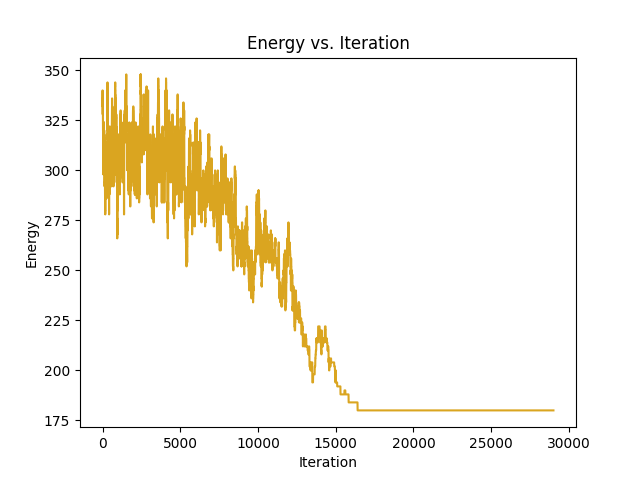

Temperature plot for the solution:

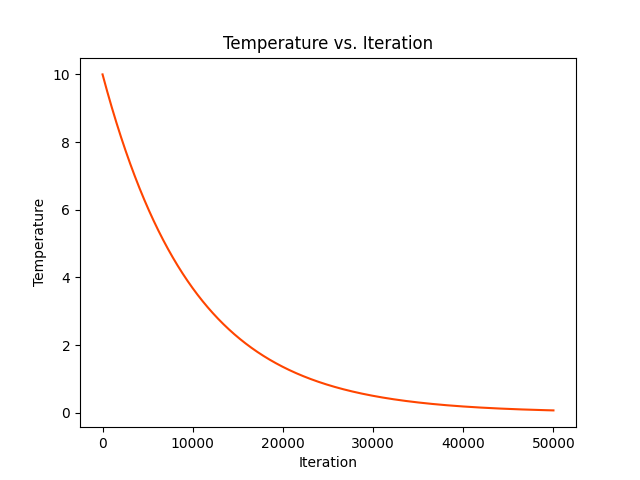

Final solution:

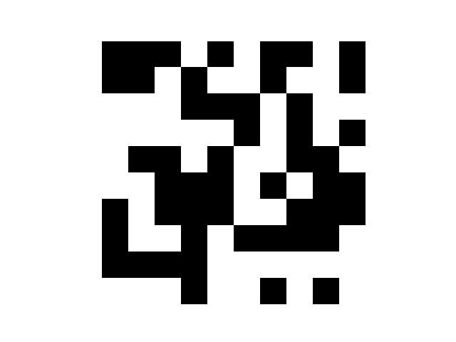

</font>

<font size="5">

**Using the eight-neighbours energy function:**
</font>

Finding the energy of the image:
```python
if energy_type == Energytype.EIGHT:
    for i in range(height):
        for j in range(width):
            current_color = img[i][j]

            for x,y in [(0,1),(1,0),(-1,0),(0,-1),(-1,-1),(1,1),(-1,1),(1,-1)]:
                if i+x >= 0 and i+x < height and j+y >= 0 and j+y < width:
                    energy += 1 if img[i+x][j+y] != current_color else 0
```

<font size="3">

This is the energy plot for the solution:

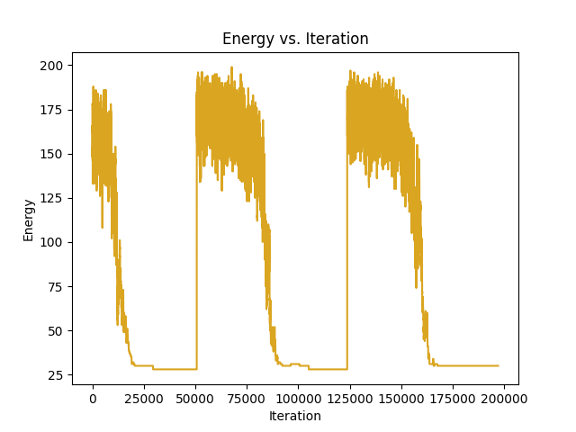

Temperature plot for the solution:

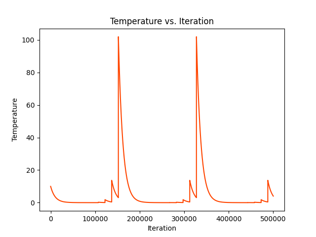

Final solution:

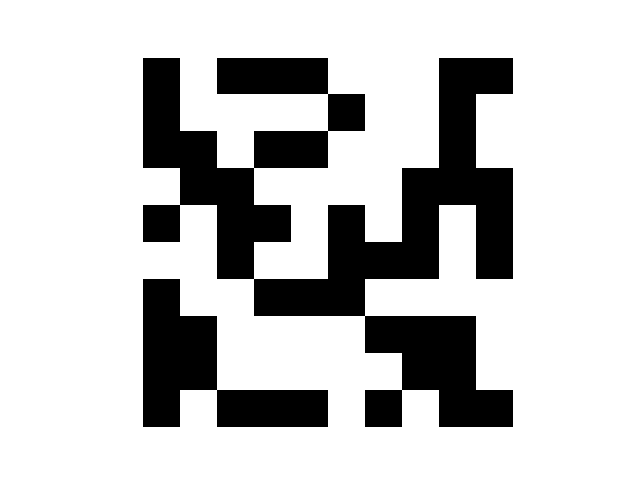

</font>

<font size="5">

**Using the 2-corners energy function for smaller img:**
</font>

Finding the energy of the image:
```python
if energy_type == Energytype.CORNERS:
    for i in range(height):
        for j in range(width):
            
            current_color = 1
            if img[i][j] == current_color:

                for x,y in [(-1,-1),(1,1)]:
                    if i+x >= 0 and i+x < height and j+y >= 0 and j+y < width:
                        energy += 1 if img[i+x][j+y] != current_color else 0
                
                for x,y in [(-1,1),(1,-1)]:
                    if i+x >= 0 and i+x < height and j+y >= 0 and j+y < width:
                        energy += 1 if img[i+x][j+y] == current_color else 0
```

<font size="3">

This is the energy plot for the solution:

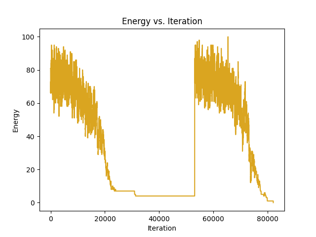

Temperature plot for the solution:

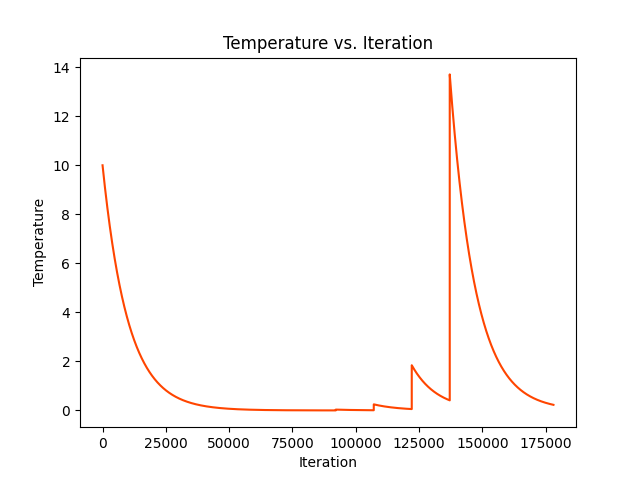

Final solution:

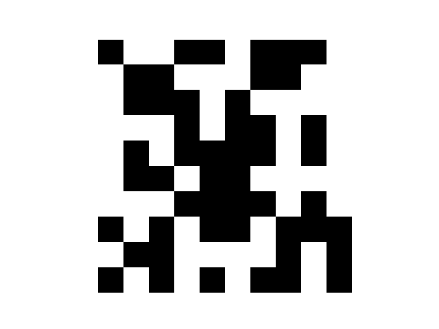


</font>


<font size="5">

**Using the 2-corners energy function for bigger img:**

</font>
<font size="3">

This is the energy plot for the solution:

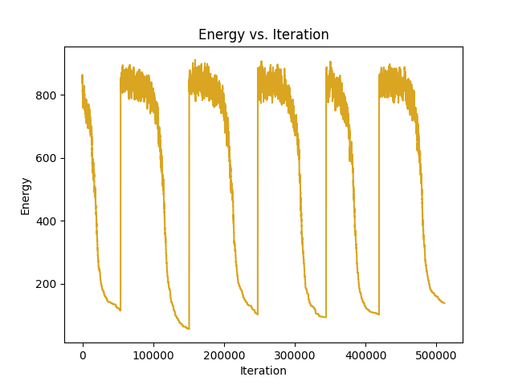

Temperature plot for the solution:

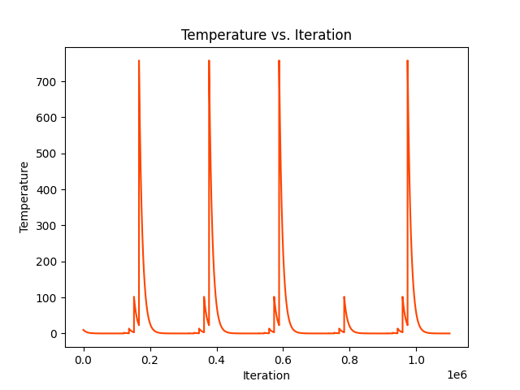

Final solution:

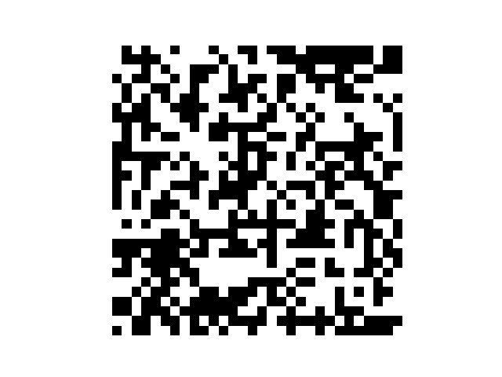

</font>


<font size="5">

**Using the 4-corners energy function for bigger img:**
</font>

```python
if energy_type == Energytype.BOTH_CORNERS:
    for i in range(height):
        for j in range(width):
            
            current_color = 1
            if img[i][j] == current_color:

                for x,y in [(-1,-1),(1,1),(-1,1),(1,-1)]:
                    if i+x >= 0 and i+x < height and j+y >= 0 and j+y < width:
                        energy += 1 if img[i+x][j+y] != current_color else 0
                        
                for x,y in [(0,1),(1,0),(-1,0),(0,-1)]:
                    if i+x >= 0 and i+x < height and j+y >= 0 and j+y < width:
                        energy += 1 if img[i+x][j+y] == current_color else 0
```

<font size="3">

This is the energy plot for the solution:

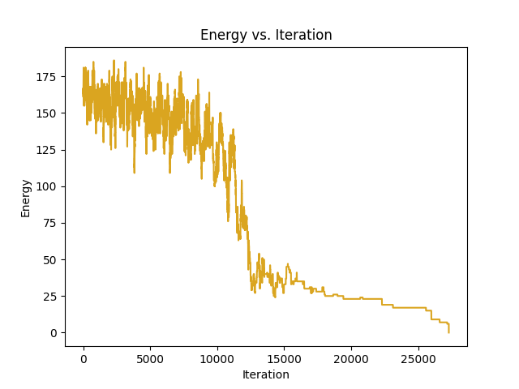

Temperature plot for the solution:

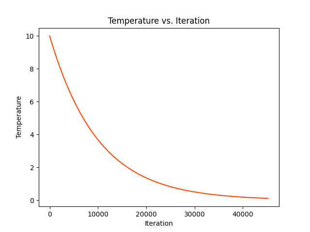

Final solution:

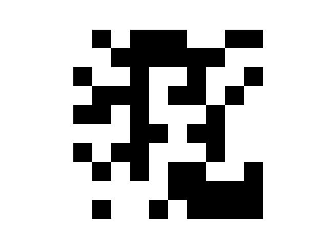

</font>

Source code for solving the problem can be found in file: [solve.py](solve.py)